# 🎨 Hoterra Frontend

A modern, robust hotel room booking platform built with **React 18** and **TypeScript**. Hoterra provides a seamless experience for guests to browse and book rooms, while offering powerful tools for administrators and receptionists to manage inventory and reservations.


## 📱 Live Application

- **Frontend**: [https://rad-course-work-hoterra-frontend.vercel.app](https://rad-course-work-hoterra-frontend.vercel.app)
- **Backend API**: [https://rad-course-work-hoterra-backend.vercel.app](https://rad-course-work-hoterra-backend.vercel.app)

## 📸 Screenshots

### 🔑 Authentication & Onboarding
| Welcome / Landing | Login Page | Registration |
|:---:|:---:|:---:|
| 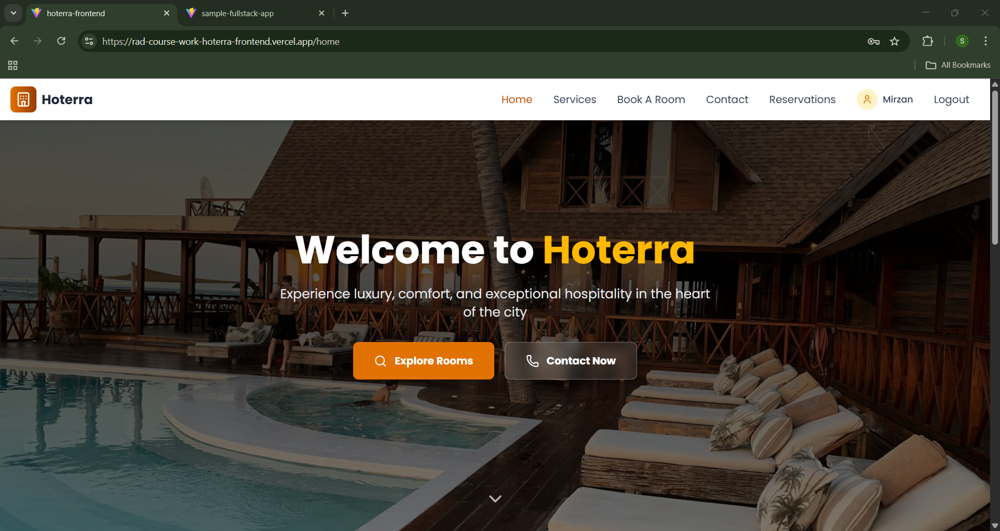 | 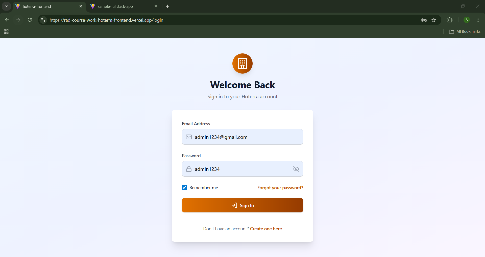 | 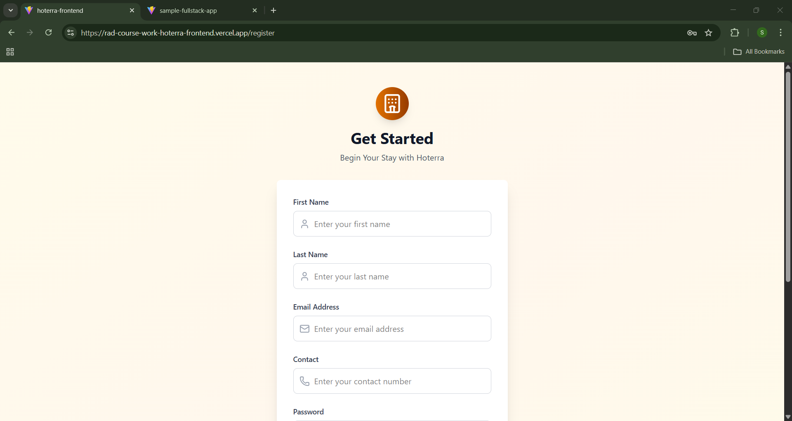 |

---

### 🏨 Room Discovery & Types
| Room Overview | Detailed View | Type Management |
|:---:|:---:|:---:|
| 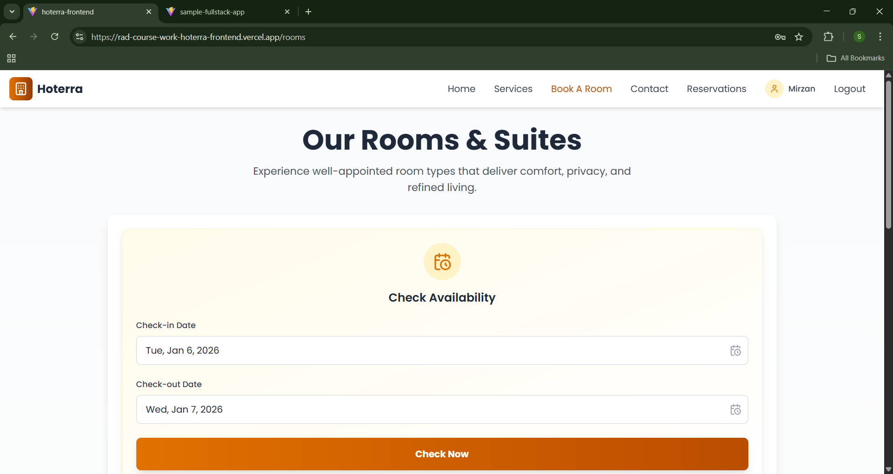 | 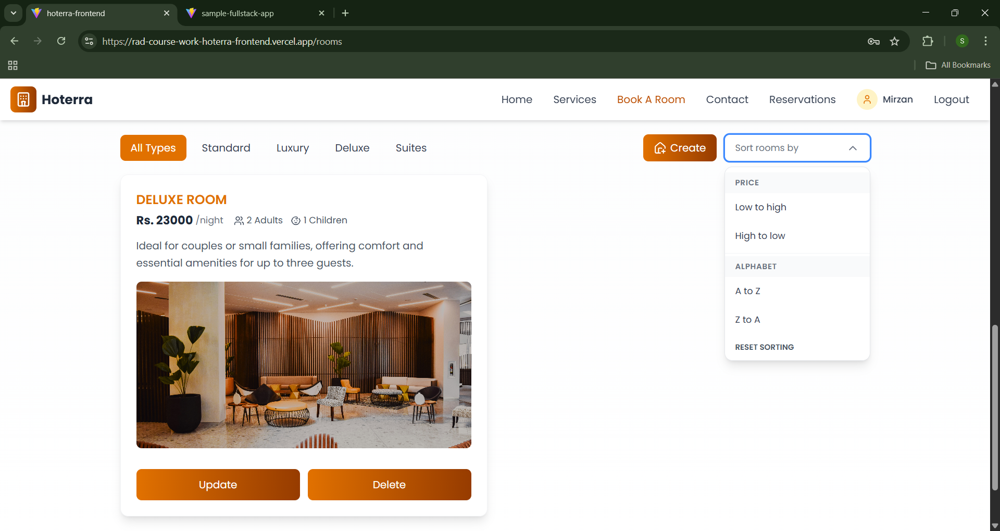 | 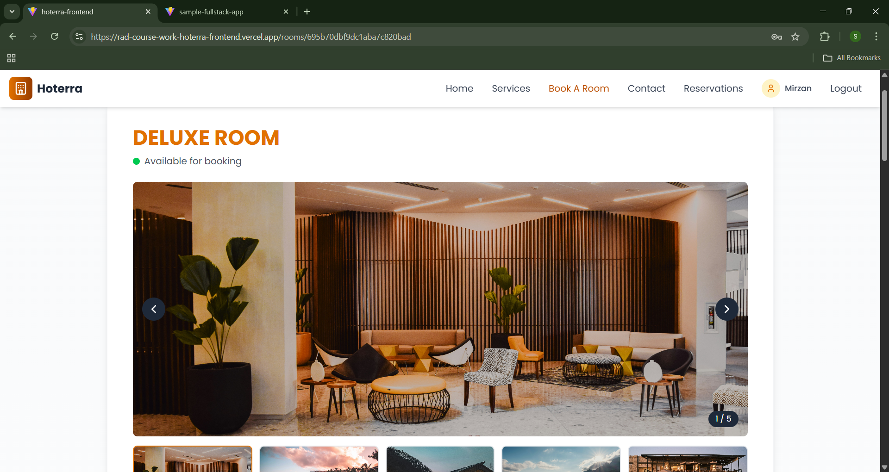 |

#### More Room Previews
| Room Type A | Room Type B | Room Type C |
|:---:|:---:|:---:|
|  | 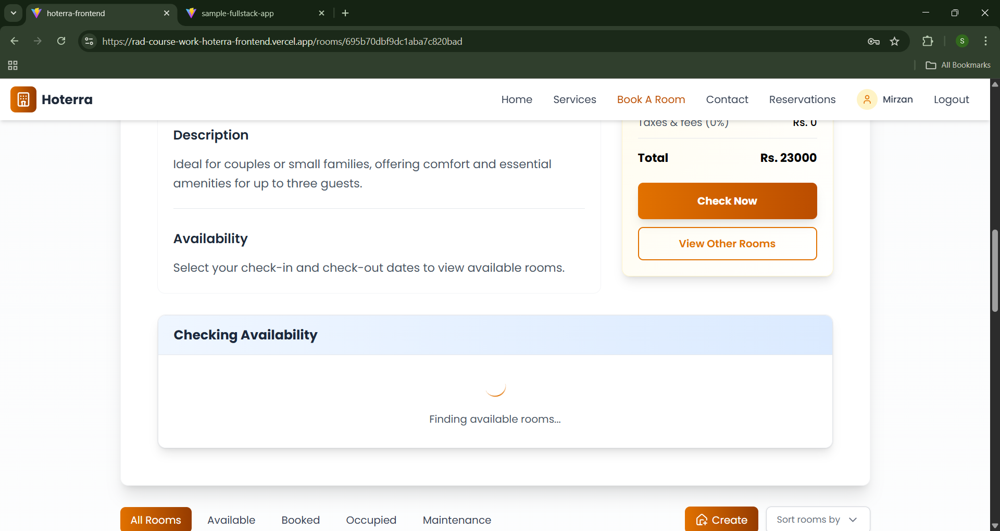 | 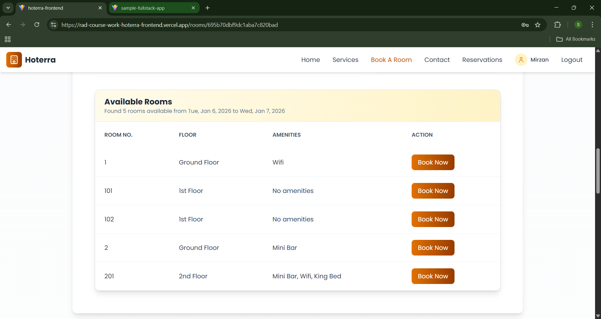 |

---

### 📅 Booking Flow
| Availability Check | Reservation Form | Confirmation |
|:---:|:---:|:---:|
| 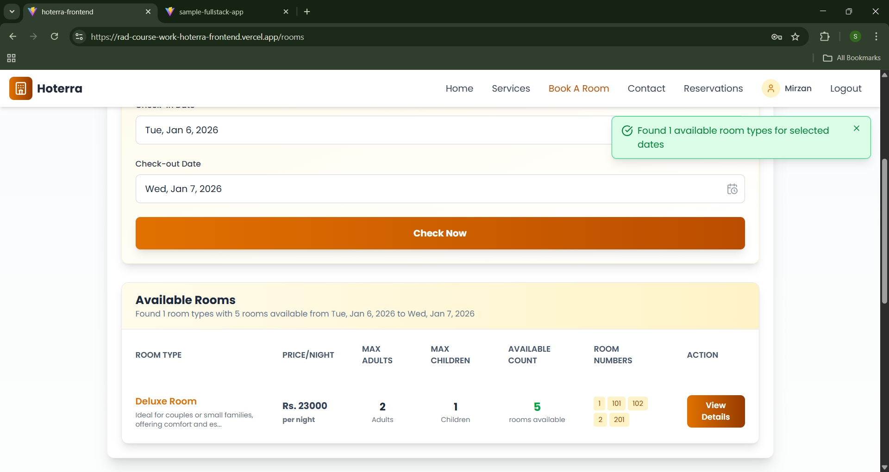 | 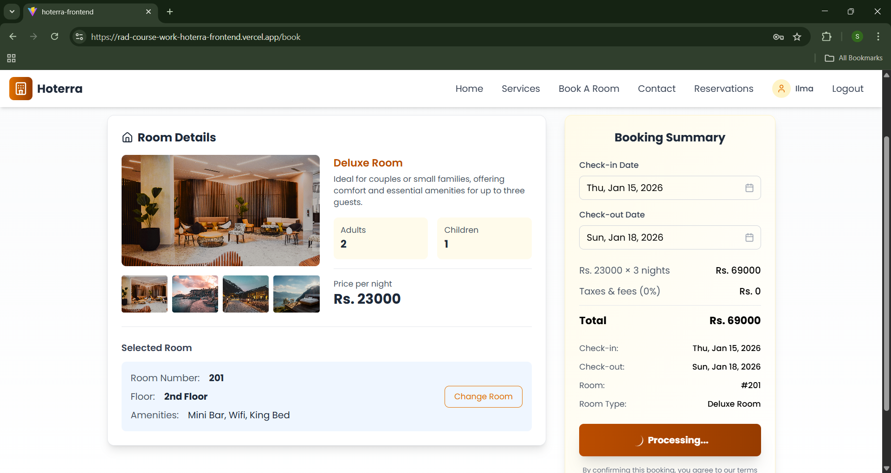 | 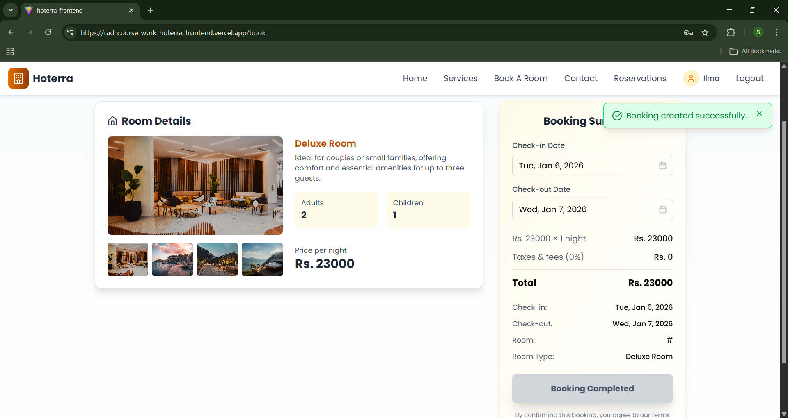 |

| My Stays | No Bookings State |
|:---:|:---:|
|  | 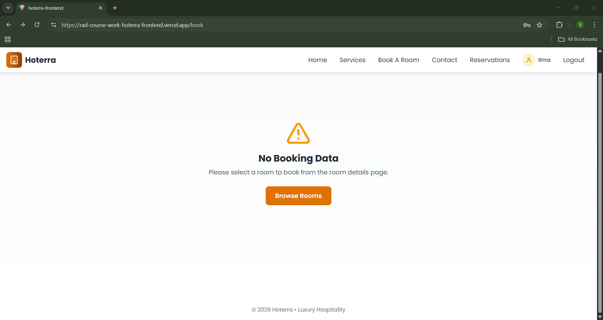 |

---

### 🛠️ Administrative & Staff Portal
| All Bookings | Add New Room | Update Room |
|:---:|:---:|:---:|
| 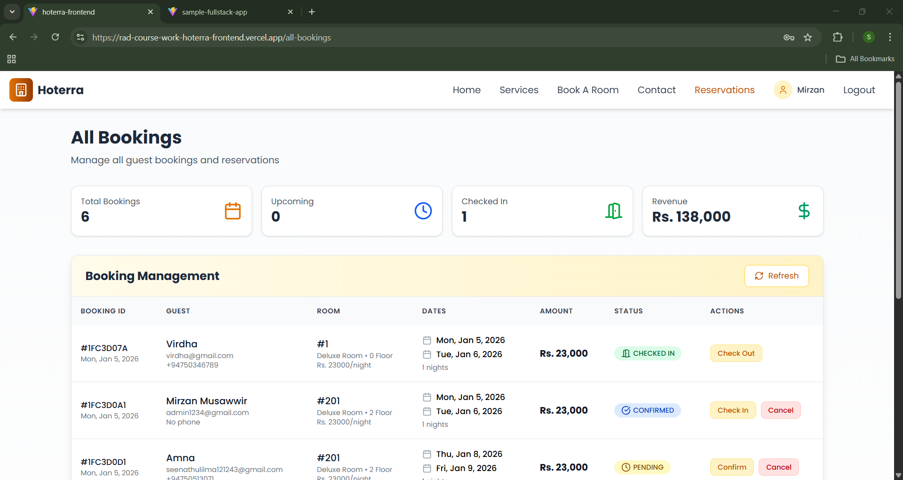 | 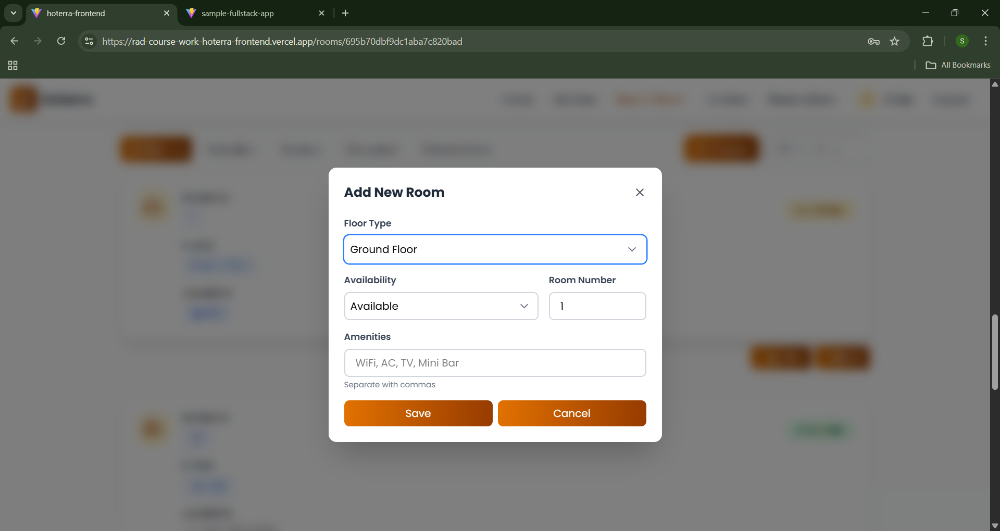 | 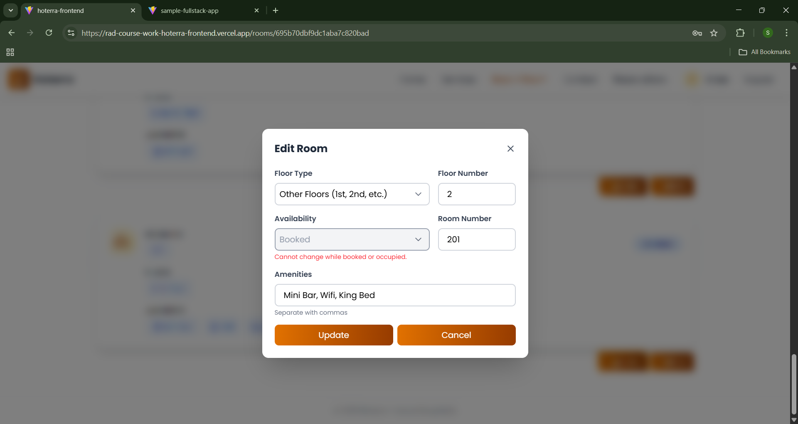 |

| Staff Invitation |
|:---:|
| 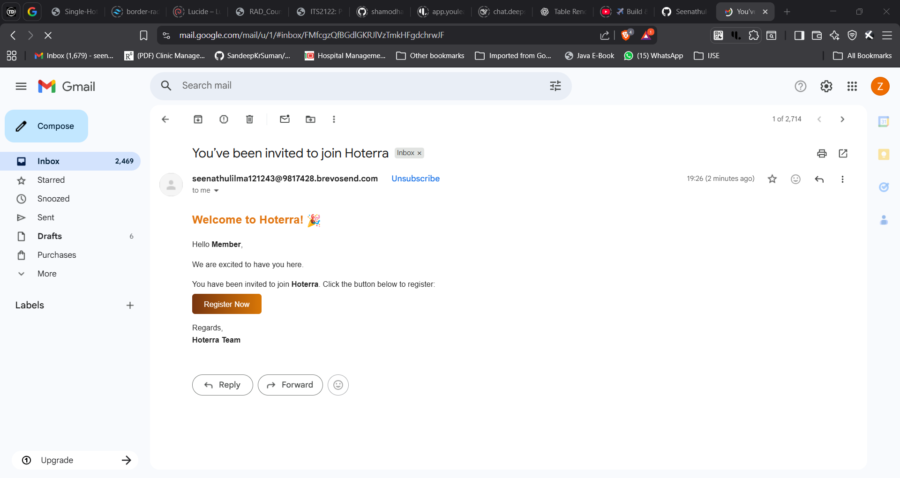 |

---

### 📞 Services & Support
| Hotel Services | Contact Information |
|:---:|:---:|
| 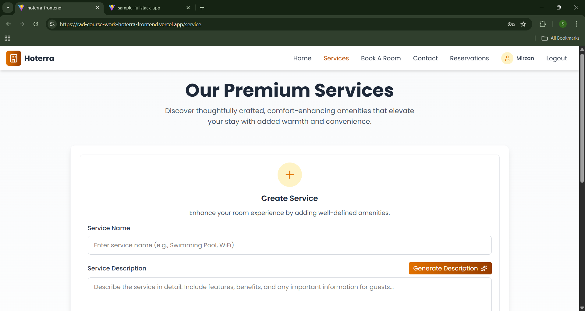 | 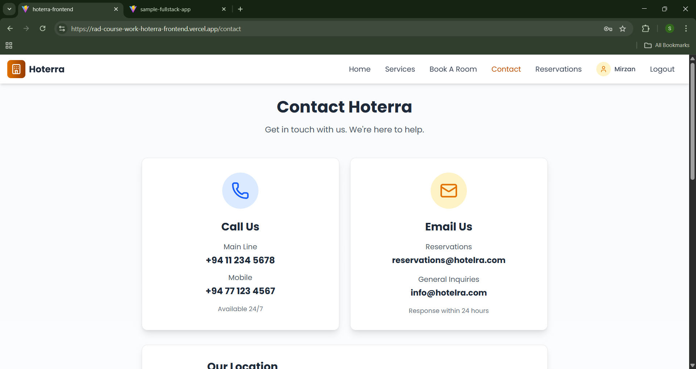 |

## 🛠️ Tech Stack

- **React 18**: UI library for building interactive interfaces with hooks and concurrent features
- **Vite**: Next-generation frontend tooling for fast builds and development server
- **TypeScript**: Ensures type safety and better developer experience
- **Tailwind CSS**: Utility-first CSS framework for rapid UI development
- **Axios**: Promise-based HTTP client for API requests with interceptors
- **Context API**: Native state management for authentication and global state
- **Lucide React**: Beautiful & consistent icon library for UI elements

## 📋 Prerequisites

- Node.js (v16 or higher)
- npm or yarn package manager
- Backend API running (or deployed)
- Git for version control

## 🚀 Getting Started

### Installation

```bash
# Clone the repository
git clone https://github.com/Seenathul-Ilma/RAD_CourseWork_Hoterra_Frontend.git
cd hoterra-frontend

# Install dependencies
npm install
```

### Environment Setup

Create a `.env` file in the root directory (see `.env.example`):

```env
VITE_API_BASE_URL=https://rad-course-work-hoterra-backend.vercel.app
```

*For local development use:*
```env
VITE_API_BASE_URL=http://localhost:5000
```

### Run Development Server

```bash
npm run dev
```

Application will run at `http://localhost:5173`

---

## 📂 Project Structure

```
src/
├── components/                          # Reusable UI components
│   ├── ErrorMessage.tsx                 # Error notification component with styling
│   ├── Footer.tsx                       # Application footer with links & info
│   ├── Header.tsx                       # Navigation header with user menu
│   ├── Layout.tsx                       # Main layout wrapper for pages
│   └── SuccessMessage.tsx               # Success notification component
├── context/                             # Global state management
│   └── authContext.tsx                  # Authentication context with login/logout
├── pages/                               # Page components (routes)
│   ├── AllBookings.tsx                  # Admin/Staff booking dashboard view
│   ├── Contact.tsx                      # Hotel contact information page
│   ├── Home.tsx                         # Main dashboard after user login
│   ├── Login.tsx                        # User login authentication page
│   ├── MakeBooking.tsx                  # Room reservation workflow page
│   ├── MyStays.tsx                      # User's booking history & current stays
│   ├── Register.tsx                     # New user registration page
│   ├── RoomDetail.tsx                   # Detailed room info & amenities view
│   ├── Rooms.tsx                        # Room browsing & filtering page
│   ├── Service.tsx                      # Hotel services & amenities list page
│   ├── Staff.tsx                        # Staff management interface (admin only)
│   └── Welcome.tsx                      # Landing/welcome page
├── routes/                              # Route definitions and protection
│   └── index.tsx                        # Route configuration with ProtectedRoute
├── services/                            # API service layer (API calls)
│   ├── amenity.ts                       # Amenity API endpoints
│   ├── api.ts                           # Axios instance & configuration
│   ├── auth.ts                          # Authentication API calls & JWT handling
│   ├── availability.ts                  # Room availability checking logic
│   ├── booking.ts                       # Booking CRUD operations
│   ├── room.ts                          # Room API endpoints
│   └── roomtype.ts                      # Room type API endpoints
├── utils/                               # Utility functions & helpers
│   └── keepBackendWarm.ts               # Serverless cold start prevention
├── assets/                              # Images, icons, and static files
├── App.tsx                              # Main app component with routing
├── App.css                              # Global application styles
├── index.css                            # Base CSS styles & resets
└── main.tsx                             # Application bootstrap entry point
```

---

## 📄 Key Pages

| Page | Route | Description |
|------|-------|-------------|
| Welcome | `/` | Immersive landing page with call-to-action |
| Home | `/home` | Main user dashboard after login |
| Rooms | `/rooms` | Browse all rooms with filters |
| Room Details | `/room/:id` | Detailed room information and amenities |
| Make Booking | `/booking` | Room reservation with date selection |
| My Stays | `/my-stays` | User's booking history and current stays |
| All Bookings | `/all-bookings` | Admin/Staff view of all bookings |
| Services | `/service` | Hotel services and amenities list |
| Contact | `/contact` | Hotel contact information |
| Staff Management | `/staff` | Manage staff members (admin only) |
| Login | `/login` | User authentication page |
| Register | `/register` | New user account registration |

---

## 🔌 API Integration

The frontend communicates with the backend through structured service modules in the `services/` directory. Each service handles specific API operations.

### Authentication Service (`auth.ts`)

Handles user authentication and JWT token management.

```typescript
login(email: string, password: string)
// Authenticate user with email and password
// Returns: User object and JWT token

register(firstName: string, lastName: string, email: string, password: string, phone: string)
// Register new user account
// Returns: User object and JWT token

logout()
// Clear authentication tokens and user state
// Returns: Success confirmation
```

### Room Service (`room.ts`)

Manages room data retrieval and management operations.

```typescript
getAllRooms()
// Fetch all available rooms with details
// Returns: Array of room objects

getRoomById(id: string)
// Get specific room details by ID
// Returns: Single room object with amenities

createRoom(data: RoomData)
// Create new room (admin only)
// Returns: Created room object

updateRoom(id: string, data: RoomData)
// Update room information (admin only)
// Returns: Updated room object

deleteRoom(id: string)
// Delete room from system (admin only)
// Returns: Success confirmation
```

### Booking Service (`booking.ts`)

Handles all booking-related operations.

```typescript
createBooking(data: BookingData)
// Create new room reservation
// Returns: Booking confirmation object

getUserBookings()
// Fetch user's booking history
// Returns: Array of user's bookings

getBookingById(id: string)
// Get specific booking details
// Returns: Single booking object with room details

getAllBookings()
// Fetch all bookings (admin/staff only)
// Returns: Array of all bookings in system

updateBooking(id: string, data: BookingData)
// Update booking status or details
// Returns: Updated booking object

cancelBooking(id: string)
// Cancel existing booking
// Returns: Cancellation confirmation
```

### Availability Service (`availability.ts`)

Checks room availability for date ranges.

```typescript
checkAvailability(roomId: string, checkInDate: string, checkOutDate: string)
// Check if specific room is available for dates
// Returns: Boolean availability status

getAvailableRooms(checkInDate: string, checkOutDate: string)
// Find all rooms available for date range
// Returns: Array of available room objects
```

### Amenity Service (`amenity.ts`)

Manages hotel amenities.

```typescript
getAllAmenities()
// Fetch all available amenities
// Returns: Array of amenity objects

createAmenity(data: AmenityData)
// Create new amenity (admin only)
// Returns: Created amenity object

updateAmenity(id: string, data: AmenityData)
// Update amenity details (admin only)
// Returns: Updated amenity object

deleteAmenity(id: string)
// Delete amenity (admin only)
// Returns: Success confirmation
```

### Room Type Service (`roomtype.ts`)

Manages room type categories.

```typescript
getAllRoomTypes()
// Fetch all room types
// Returns: Array of room type objects

createRoomType(data: RoomTypeData)
// Create new room type (admin only)
// Returns: Created room type object

updateRoomType(id: string, data: RoomTypeData)
// Update room type details (admin only)
// Returns: Updated room type object

deleteRoomType(id: string)
// Delete room type (admin only)
// Returns: Success confirmation
```

---

## 🎯 Features

### User Features
- ✅ **Smart Room Browsing**: Browse rooms with advanced filters for amenities, price range, and capacity
- ✅ **Advanced Availability Checking**: Check room availability by type or search for available rooms within date ranges
- ✅ **Seamless Booking**: Intuitive booking flow with date picker and real-time price calculation
- ✅ **Booking Management**: View complete booking history, current stays, and detailed reservation information
- ✅ **User Profile**: Manage personal details, contact information, and profile settings
- ✅ **Service Information**: Browse hotel services and available amenities
- ✅ **Contact Information**: Easy access to hotel contact details and support options

### Admin & Staff Features
- ✅ **Role-Based Access Control**: Secure dashboards with role-specific permissions and features
- ✅ **Complete Booking Management**: View, filter, and manage all hotel bookings across the platform
- ✅ **Inventory Management**: Create, update, and delete rooms with detailed information
- ✅ **Room Type Management**: Create and manage different room categories with pricing
- ✅ **Amenity Management**: Manage available amenities and room features
- ✅ **Secure Staff Invitations**: Email-based staff registration with secure token validation
- ✅ **Real-Time Availability**: Track room availability status in real-time
- ✅ **Occupancy Reports**: View current and historical occupancy data

---

## 🔑 Authentication

Authentication is managed using **Context API** with JWT tokens.

### How It Works

1. User logs in via `/login` page
2. Backend validates credentials and returns JWT token
3. Token is stored in React Context and browser state
4. Token is automatically attached to all API requests via Axios interceptor
5. Token is included in `Authorization` header: `Bearer <token>`
6. Protected routes check token validity before rendering

### Using Auth Context

```typescript
import { useContext } from 'react';
import { AuthContext } from './context/authContext';

function MyComponent() {
  const { user, isLoggedIn, login, logout } = useContext(AuthContext);
  
  if (!isLoggedIn) {
    return <p>Please log in</p>;
  }
  
  return <p>Welcome, {user.firstName}!</p>;
}
```

### Protected Routes

Routes are protected using the `ProtectedRoute` component that checks authentication and user role:

```typescript
<ProtectedRoute 
  element={<AdminDashboard />} 
  requiredRole="admin" 
/>
```

---

## 📋 Request/Response Format

### Success Response
```json
{
  "success": true,
  "data": {
    // Response data here
  },
  "message": "Operation successful"
}
```

### Error Response
```json
{
  "success": false,
  "error": "ERROR_CODE",
  "message": "Detailed error message explaining what went wrong"
}
```

---

## 📦 Build & Deployment

### Build for Production

```bash
npm run build
```

This creates an optimized `dist/` folder ready for deployment.

### Preview Production Build

```bash
npm run preview
```

Test the production build locally before deployment.

### Deploy to Vercel

```bash
# Install Vercel CLI
npm install -g vercel

# Deploy
vercel
```

Set environment variables in Vercel dashboard:
- `VITE_API_BASE_URL` = Your backend API URL

The `dist/` folder is automatically optimized for deployment on Vercel, Netlify, or any static hosting service.

---

## 🌐 CORS Configuration

The backend must be configured to accept requests from the frontend URL:

**Development**: 
```
http://localhost:5173
```

**Production**: 
```
https://rad-course-work-hoterra-frontend.vercel.app
```

Update `CORS_ORIGIN` in backend `.env` file accordingly. The backend will reject requests from non-whitelisted origins.

---

## ⚡ Performance Optimization

The app includes a utility to prevent the Vercel backend serverless function from idling (cold starts):

```typescript
// keepBackendWarm.ts
// Sends health check ping every 5 minutes
setInterval(() => {
  fetch(`${API_BASE_URL}/health`)
}, 5 * 60 * 1000);
```

This ensures faster response times when users first interact with the application.

---

## 📚 Available Scripts

```bash
npm run dev      # Start development server with hot reload
npm run build    # Build TypeScript and assets for production
npm run preview  # Preview production build locally
npm run lint     # Run ESLint (if configured)
```

---

## 🐛 Troubleshooting

### CORS Errors (Access blocked by CORS policy)
- Verify `VITE_API_BASE_URL` in `.env` matches the actual backend URL exactly
- Check backend has correct `CORS_ORIGIN` configured
- Ensure backend server is running and accessible
- Clear browser cache and cookies before testing
- Check browser console for detailed CORS error messages

### API 404 Errors
- Verify backend server is running and accessible
- Check backend API endpoints are correct
- Confirm `VITE_API_BASE_URL` is set to correct backend address
- Test API endpoints using Postman or curl

### Blank Page or Content Not Loading
- Check browser console for JavaScript errors
- Verify all environment variables in `.env` are set correctly
- Clear browser cache (Ctrl+Shift+Delete or Cmd+Shift+Delete)
- Hard refresh the page (Ctrl+F5 or Cmd+Shift+R)
- Check network tab in DevTools for failed requests

### Authentication/Login Issues
- Ensure backend `/api/v1/auth/login` endpoint is working
- Verify credentials are correct (email and password)
- Check that JWT token is being stored in browser state
- Clear stored credentials and try logging in again
- Verify backend JWT_SECRET is set

### Images Not Loading
- Check Cloudinary configuration on backend
- Verify image URLs in response are accessible
- Check browser console for image load errors
- Ensure backend is successfully uploading images to Cloudinary

### Booking Not Creating
- Verify room ID is valid and room exists
- Check check-in and check-out dates are valid
- Ensure selected dates are in future and properly formatted
- Verify room is actually available for selected dates
- Check console for API error messages

### State/Data Not Persisting After Refresh
- AuthContext stores data in browser state (not localStorage)
- Tokens are preserved but user data may need to be re-fetched
- Consider implementing persistent storage if needed
- Check that API calls are completing successfully

### Development Server Not Starting
- Delete `node_modules` folder: `rm -rf node_modules`
- Clear npm cache: `npm cache clean --force`
- Reinstall dependencies: `npm install`
- Check for Node.js version compatibility (v16+)
- Check port 5173 is available or change in Vite config

### Build Failures
- Check for TypeScript errors: `npx tsc --noEmit`
- Verify all imports and file paths are correct
- Check for unused variables or imports
- Ensure all dependencies are installed
- Review error messages in build output

---

## 🧪 Testing

```bash
npm test              # Run test suite
npm test -- --watch   # Run tests in watch mode
npm test -- --coverage # Generate coverage report
```

---

## 🤝 Contributing

1. Create a feature branch: `git checkout -b feature/feature-name`
2. Make changes and test thoroughly on local machine
3. Commit with clear messages: `git commit -m 'Add feature description'`
4. Push to branch: `git push origin feature/feature-name`
5. Create a Pull Request with detailed description of changes

---

## 📝 License

### License 1: Academic and Personal Learning License
This project is © 2026 Zeenathul Ilma. It is not open-source and may not be reused or copied without permission.

This project was created and developed by Zeenathul Ilma as part of academic and personal learning initiatives. All rights reserved. No part of this project may be copied, reused, or distributed without written permission from the author.

🚫 Copying or reusing this code without permission is strictly prohibited and may result in academic consequences.

### License 2: Proprietary License
This project is licensed under a Proprietary License. See [LICENSE.txt](LICENSE.txt) for details.

---

## 👩‍💻 Author

**Zeenathul Ilma**
- GitHub: [@Seenathul-Ilma](https://github.com/Seenathul-Ilma)
- Portfolio: [zeenathulilma.vercel.app](https://zeenathulilma.vercel.app)
- Email: Contact via GitHub profile

---

## 📚 Related Repositories

- **Backend Repository**: [RAD_CourseWork_Hoterra_Backend](https://github.com/Seenathul-Ilma/RAD_CourseWork_Hoterra_Backend)
- **Deployed Backend**: [https://rad-course-work-hoterra-backend.vercel.app](https://rad-course-work-hoterra-backend.vercel.app)

---

## 🎓 Project Context

Hoterra Frontend was developed as part of a comprehensive coursework project demonstrating modern web development skills including:

- **React Architecture**: Component-based design, hooks, context API
- **TypeScript**: Type-safe development with interfaces and custom types
- **State Management**: Global state with Context API and local component state
- **API Integration**: Axios interceptors, error handling, data transformation
- **Responsive Design**: Mobile-first approach with Tailwind CSS
- **Authentication**: JWT token management and role-based access control
- **Performance**: Code splitting, lazy loading, optimization strategies
- **Deployment**: Vercel deployment, environment configuration, CI/CD concepts

For questions or support, please refer to the GitHub repository or contact the author directly.